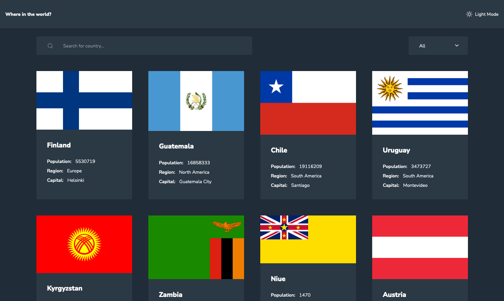
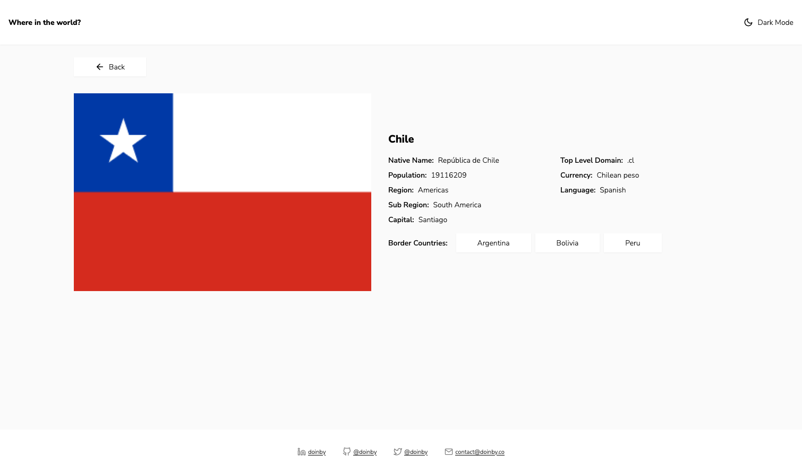

# Frontend Mentor - REST Countries API Solution

## Table of contents

- [Overview](#overview)
  - [The challenge](#the-challenge)
  - [Screenshot](#screenshot)
  - [Links](#links)
- [My process](#my-process)
  - [Built with](#built-with)
  <!-- - [What I learned](#what-i-learned) -->
  - [Continued development](#continued-development)
  - [Useful resources](#useful-resources)
- [Author](#author)
<!-- - [Acknowledgments](#acknowledgments) -->

## Overview

Nation Flags is a ReactJS app that helps users learn crucial information about a country. Details such as population, capital, native name and national flag are organized in a clear and concise manner.

The proposal of this app and figma design file was provided by [Frontend Mentor](https://www.frontendmentor.io/challenges/rest-countries-api-with-color-theme-switcher-5cacc469fec04111f7b848ca). All country data were fetched via [REST Countries API](https://restcountries.com/).

### The challenge

Users should be able to:

- See all countries from the API on the homepage
- Search for a country using an `input` field
- Filter countries by region
- Click on a country to see more detailed information on a separate page
- Click through to the border countries on the detail page
- Toggle the color scheme between light and dark mode _(optional)_

### Screenshot





### Links

- [Live Site](https://nation-flags.co/)
- [Github Repository](https://github.com/doinby/nation-flags-react-typescript)
- [Frontend Mentor Solution Page](https://www.frontendmentor.io/solutions/nation-flags-reactjs-typescript-tailwindcss-lznt5b_nGD)

## My process

### Built with

- [React](https://reactjs.org/) - Javascript Framework
- [Typescript](https://www.typescriptlang.org/) -
- [Tailwind](https://tailwindcss.com/)
- [ReactRouter](https://reactrouter.com/)
- [HeadlessUI](https://headlessui.com/)
- Semantic HTML5 markup
- CSS Flexbox, Grid
- Mobile-first workflow

<!-- ## What I learned

Use this section to recap over some of your major learnings while working through this project. Writing these out and providing code samples of areas you want to highlight is a great way to reinforce your own knowledge.

To see how you can add code snippets, see below:

```html
<h1>Some HTML code I'm proud of</h1>
```

```css
.proud-of-this-css {
  color: papayawhip;
}
```

```js
const proudOfThisFunc = () => {
  console.log('🎉');
};
``` -->

<!-- [The Markdown Guide](https://www.markdownguide.org/) -->

### Continued development

<!-- Use this section to outline areas that you want to continue focusing on in future projects. These could be concepts you're still not completely comfortable with or techniques you found useful that you want to refine and perfect. -->

- Apply [debounce](https://blog.webdevsimplified.com/2020-10/react-debounce/) to search query to improve search result filter
- Improve error feedbacks - more specific error messages
- Replace `type: any` with mode specific types

### Useful resources

- [React Typescript Cheatsheet](https://react-typescript-cheatsheet.netlify.app/docs/basic/getting-started/basic_type_example/) - Great code example of declaring common React types
- [Ultimate React Router 6 Guide](https://blog.webdevsimplified.com/2022-07/react-router/) - I used this to learn how to dynamically route individual country page, what `useParam()` does, how to use `<Link>` and `<Outlet />`
- [Tailwind Dark Mode Doc](https://tailwindcss.com/docs/dark-mode#toggling-dark-mode-manually) - Tailwind's dark mode is so much easier to implement compares to MUI 🤩

## Author

- Website - [www.doinby.co](https://www.doinby.co)
- Frontend Mentor - [@doinby](https://www.frontendmentor.io/profile/doinby)
- Linkedin - [doinby](https://www.linkedin.com/in/doinby/)
- Twitter - [@doinby](https://www.twitter.com/doinby)

<!-- ## Acknowledgments

This is where you can give a hat tip to anyone who helped you out on this project. Perhaps you worked in a team or got some inspiration from someone else's solution. This is the perfect place to give them some credit.

**Note: Delete this note and edit this section's content as necessary. If you completed this challenge by yourself, feel free to delete this section entirely.** -->
